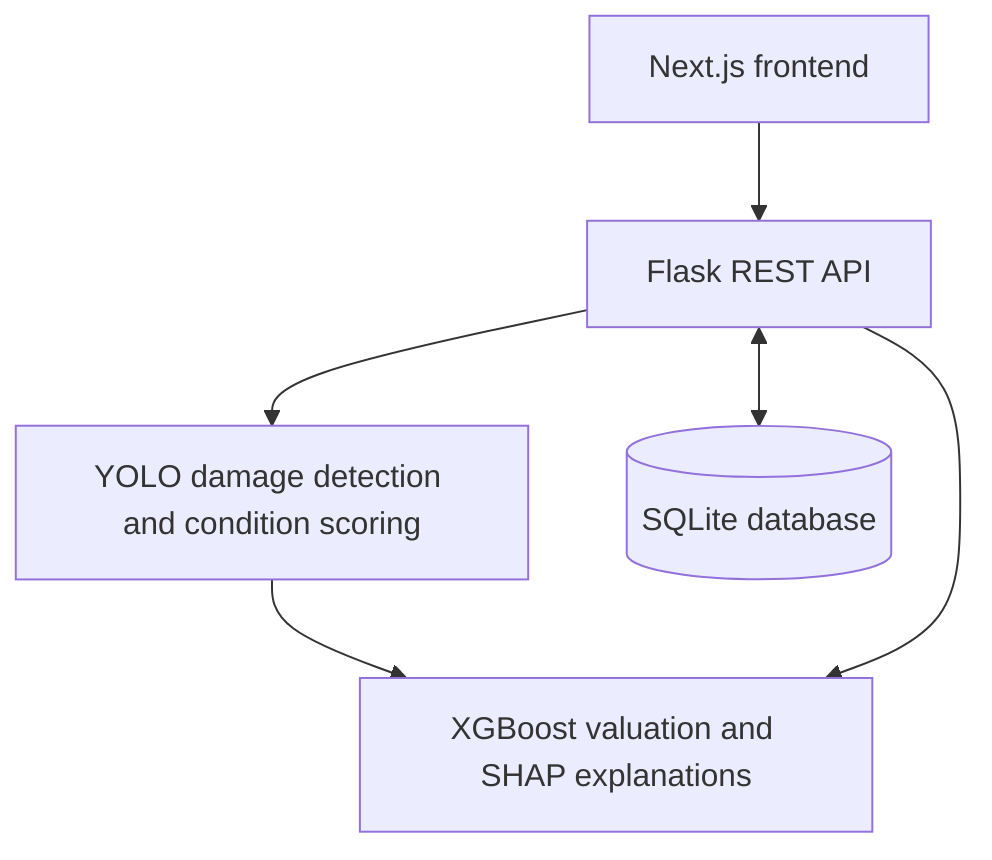

# AutoGauge

### AI-Powered Used Vehicle Valuation and Decision Support System

AutoGauge estimates used-vehicle prices by combining vehicle details with photo-based condition assessment. It brings together an XGBoost valuation model, YOLO damage detection, and SHAP-based price explanations in a Next.js web application backed by a Flask API.

Developed as a final-year B.Tech Information Technology project, AutoGauge explores how machine learning and computer vision can make vehicle valuation more transparent.

## Features

- **Vehicle valuation:** Estimate prices using details such as brand, model, year, kilometres driven, fuel type, transmission, city, body type, and ownership.
- **Photo-based condition assessment:** Detect supported visible damage categories and derive a condition score from uploaded vehicle photos.
- **Price explanations:** View the contribution of model features to an estimate through a SHAP-based breakdown.
- **Account access:** Register, sign in, and manage basic profile information through JWT-protected API routes.
- **Dashboard and history:** Review previous valuations and account activity.
- **Saved vehicles:** Keep selected valuation results for later reference.
- **PDF reports:** Download a valuation report from the frontend.
- **Dark interface:** A black-and-lime design with a guided estimation workflow.

## How it works

1. The user signs in and enters vehicle details.
2. The user optionally uploads vehicle photographs.
3. A trained YOLO model detects supported types of visible damage.
4. Condition-scoring logic converts detections into a numerical condition score.
5. The valuation pipeline combines vehicle information with condition information to estimate a price.
6. SHAP-based explanations show how model features influence the result.
7. The user can review, save, or download the valuation.

The current no-photo path uses a condition score of `1.0`. This is a software fallback, not evidence that a vehicle is in perfect condition.

## Architecture



## Technology stack

| Layer | Technologies |
| --- | --- |
| Frontend | Next.js, React, JavaScript, CSS, Tailwind CSS |
| Interface and reports | Lucide React, Recharts, jsPDF |
| Backend | Python, Flask, Flask-CORS, Flask-JWT-Extended |
| Price prediction | XGBoost, scikit-learn, pandas, NumPy, joblib |
| Computer vision | Ultralytics YOLO, PyTorch, OpenCV, Pillow |
| Explainability | SHAP, Matplotlib |
| Database | SQLite |
| Version control | Git and GitHub |

## Main project files

| Path | Purpose |
| --- | --- |
| `frontend/app/` | Next.js pages, login component, layouts, and styles |
| `frontend/lib/api.js` | Frontend API client |
| `frontend/components/` | Frontend components |
| `frontend/public/` | Public frontend assets |
| `api/server.py` | Flask application entry point |
| `api/routes/` | Authentication, estimation, saved-vehicle, and market routes |
| `api/requirements.txt` | Backend deployment dependencies |
| `src/fusion.py` | Vehicle price prediction pipeline |
| `src/condition_scorer.py` | Damage detection and condition scoring |
| `src/explainability.py` | SHAP-based explanation utilities |
| `src/db.py` | Database access and initialization |
| `models/` | Trained model artifacts |
| `data/` | Local data and runtime database |
| `notebooks/` | Experiments and model-development notebooks |
| `requirements.txt` | Broader Python project dependencies |

## Run locally

The commands below use Windows PowerShell. Install Git, Python, and a Node.js version compatible with the frontend before starting. Python dependencies must support the selected Python version; serialized models may also require the library versions used during training.

### 1. Clone the repository

```powershell
git clone https://github.com/danish-tech798/AutoGauge.git
cd AutoGauge
```

### 2. Create and activate a Python environment

```powershell
python -m venv .venv
.\.venv\Scripts\Activate.ps1
python -m pip install --upgrade pip
python -m pip install -r requirements.txt -r api/requirements.txt
```

The root requirements cover the broader ML development environment. The API requirements must include Flask and all inference dependencies when used alone for deployment.

### 3. Verify the model files

The application expects these trained artifacts:

```text
models/fusion_model.pkl
models/fusion_feature_columns.pkl
models/damage_detector/run/weights/best.pt
```

Keep the model and feature-column file together. Only load model artifacts from sources you trust.

### 4. Start the backend

From the repository root, in the activated environment:

```powershell
$env:JWT_SECRET_KEY = (python -c "import secrets; print(secrets.token_hex(32))")
$env:FRONTEND_ORIGINS = "http://localhost:3000"
python api\server.py
```

The local API runs at `http://127.0.0.1:5000`. Keep this terminal open.

This command generates a new secret for the current terminal session. Generating a different secret invalidates previously issued login tokens. Use a stable secret stored in the hosting environment for a deployed service; never commit it to Git.

### 5. Configure and start the frontend

Open a second terminal and enter the repository's `frontend` directory:

```powershell
cd frontend
npm ci
```

Create `frontend/.env.local` containing:

```dotenv
NEXT_PUBLIC_API_URL=http://localhost:5000/api
```

Then run:

```powershell
npm run dev
```

Open [http://localhost:3000](http://localhost:3000). Restart the frontend after changing its environment configuration. If it starts on a different port, include that origin in the backend's `FRONTEND_ORIGINS` setting and restart the backend.

### 6. Try a valuation

Create an account or sign in, open **New Estimation**, enter vehicle details, and optionally upload photographs. Review the result, factor contributions, and condition information, then save the vehicle or download the PDF report.

## Environment configuration

| Variable | Used by | Purpose |
| --- | --- | --- |
| `JWT_SECRET_KEY` | Backend | Secret used to sign authentication tokens; the configured server requires at least 32 bytes |
| `FRONTEND_ORIGINS` | Backend | Comma-separated list of allowed frontend origins |
| `PORT` | Backend | Server port supplied by the hosting environment |
| `NEXT_PUBLIC_API_URL` | Frontend | Public API base URL including `/api` |

`NEXT_PUBLIC_API_URL` is visible in the browser and must not contain credentials. Keep local `.env` files, private user data, and `data/autogauge.db` out of GitHub.

## API overview

| Method | Endpoint | Purpose |
| --- | --- | --- |
| `POST` | `/api/auth/signup` | Register an account |
| `POST` | `/api/auth/login` | Sign in |
| `GET` | `/api/auth/me` | Retrieve the current user |
| `POST` | `/api/estimations/analyze` | Submit vehicle details and optional images |
| `GET` | `/api/estimations` | Retrieve estimation history |
| `GET` | `/api/estimations/statistics` | Retrieve dashboard statistics |
| `GET` | `/api/saved-vehicles` | List saved vehicles |
| `POST` | `/api/saved-vehicles` | Save a valuation |

Protected endpoints require a JWT in the `Authorization: Bearer <token>` header. See `api/routes/` for request fields and the complete route definitions.

## Deployment status

The Next.js frontend has been deployed to Vercel. Flask backend deployment to Render is in progress; the latest reported startup failure was a missing NumPy dependency. A complete, working public frontend-to-backend deployment has not yet been verified.

For frontend deployment, the project root is `frontend`. Configure `NEXT_PUBLIC_API_URL` with the hosted backend URL and rebuild the frontend. The backend's allowed origins must include the deployed frontend domain.

The current application uses a local SQLite database. Hosting it on an ephemeral filesystem does not provide durable accounts or valuation history. Persistent database hosting and the corresponding application changes remain part of the deployment work.

## Model evaluation and limitations

- This README does not claim a verified price-prediction accuracy percentage. The login screen's displayed statistics are not a substitute for an evaluation report.
- Price regression should be reported using held-out evaluation metrics such as MAE, RMSE, and R-squared, with the dataset, split, and preprocessing documented.
- Damage detection should be evaluated separately using precision, recall, and mAP on suitable held-out images.
- A photo-based score reflects visible evidence and cannot identify hidden mechanical faults or replace a physical inspection.
- Estimates depend on training-data coverage and may differ from actual transaction prices.
- The current Market Trends page contains illustrative figures rather than a live market-data feed.
- Displayed market ranges are heuristic ranges, not calibrated statistical confidence intervals.

Dataset provenance, licensing, training splits, and reproducible evaluation results should be documented alongside the corresponding experiments before making benchmark claims.

## Future improvements

- Complete the hosted API deployment and persistent database integration.
- Publish reproducible model evaluation and dataset documentation.
- Connect market trends to a verified data source.
- Improve support for unseen vehicle models and changing market conditions.
- Optimize model loading, inference memory, and response time.

## Project team

Final-year B.Tech Information Technology project — **Team C20**.

- Danish Shaikh
- Ayaan Sayyad
- Osama Qureshi
- Huzaifa Sayed

GitHub: [danish-tech798](https://github.com/danish-tech798)

## Acknowledgements

Built with open-source tools including Next.js, React, Flask, XGBoost, scikit-learn, Ultralytics YOLO, PyTorch, and SHAP. Each dependency and dataset is subject to its respective license.
